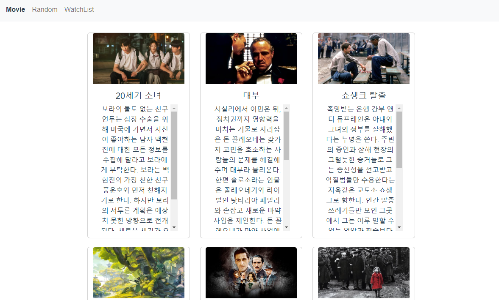
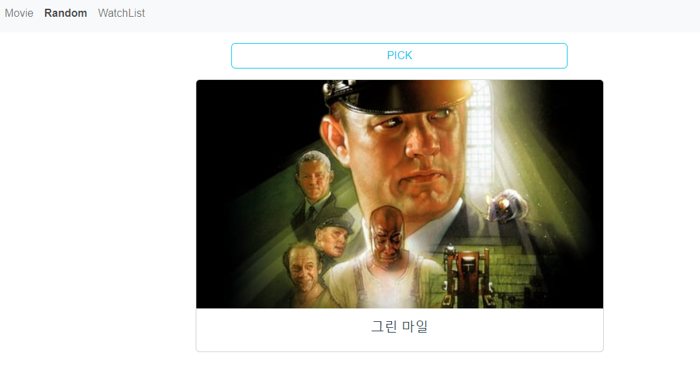
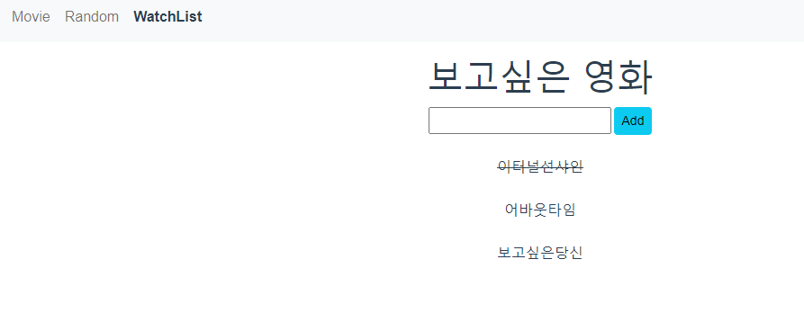

# 💗09_PJT Vue를 활용한 SPA 구성

<br>

## A.  최고 평점 영화 출력

#### 요구사항

•  네비게이션 바에서 Movie 링크(/movies)를 클릭하면 AJAX 통신을 이용하여 TMDB API로 부터 JSON 데이터를 받아와 다음과 같이 영화 목록을 출력합니다



<br>

#### 문제 접근 방법 및 코드 설명

```vue
#views/MovieView.vue

<template>
  <div class="row row-cols-md-1 row-cols-lg-3 justify-content-around" style="margin: 5px 200px;">
    <MovieCard
      v-for="(movie, index) in movies"           //movies데이터를 하나씩 
      :key="index"                               //MovieCard.vue에 보내줌
      :movie="movie"
    />
  </div>
</template>

<script>
import MovieCard from '@/components/MovieCard'
import axios from 'axios'

const API_KEY = process.env.VUE_APP_MOVIE_API_KEY
const API_URL = 'https://api.themoviedb.org/3/movie/top_rated'
const params = {
  api_key: API_KEY,
  language : 'ko',
  page : '1',
}
export default {
  name: 'MovieView',
  data() {
    return {
      movies: []
    }
  },
  components: {
    MovieCard
  },
  created() {                                 //router를 불러와 created될 때,
    axios({
      method: 'get',
      url: API_URL,
      params: params
    })
      .then(response => {                      //데이터 받아서 movies에 저장
        console.log(response.data.results)
        this.movies = response.data.results
      })
      .catch(error => {
        console.log(error)
      })
  }
}
</script>

<style>

</style>
```

```vue
#components/MovieCard.vue

<template>                               //양식에 맞춰서 띄우기
  <div class="col row justify-content-center" style="margin: 10px 0px;">
    <div class="card" style="width: 400px">
      
      <div class="card-body">
        <h5 class="card-title">{{ movieTitle }}</h5>
        <p class="card-text" style="position:relative; height:300px; overflow-y:scroll;">{{ movieDesc }}</p>
      </div>
    </div>
  </div>


</template>

<script> 
export default {
  name: 'MovieCard',
  props: {                         //movie데이터를 하나씩 받아오기
    movie: Object,
  },
  computed: {
    imgUrl() {                       //이미지url 사용가능하도록 가공
      return `https://image.tmdb.org/t/p/w500/${this.movie.backdrop_path}`
    },
    movieTitle() {
      return this.movie.title
    },
    movieDesc() {
      return this.movie.overview
    }
  }
}
</script>

<style>

</style>
```

#### ✔ 소희의 소감

역시나 AJAX 개념과 axios 개념, API 가 헷갈렸다. 어제에 이어서 다시 한 번 해봐서 그나마 좀 크게 어렵지는 않았지만, 다시 사용하려해도 저번에 한 걸 봐야할 거 같다. 일단, API 로 데이터를 가져와서 출력을 해야하고 css 부분도 어려운 거 같다.

#### ✔ 양은진 소감

- 이미지 url를 나타내기 위한 방법
- 자신의 API_KEY를 숨겨서 보안성 높이기

<br>

## B. 최고 평점 영화 중 랜덤 영화 한 개 출력

#### 요구사항

• 네비게이션 바에서 Random 링크(/random)를 클릭하면 저장된 최고 평점 영화 목록 중 랜덤으로 한 개를 출력합니다.



<br>

#### 문제 접근 방법 및 코드 설명

```html
#views/RandomView.vue
<template>
  <div>
    <b-button block variant="outline-info" @click="pickMovie" style="width:500px;">PICK</b-button>           //버튼을 클릭하면 동작하도록 만들기
    <p></p>
    <div id="flex">
      <div class="card w-50 mb-3">
        
        <div class="card-body">
          <h5 class="card-title">{{ movie.title }}</h5>
        </div>
    </div>
    </div>
  </div>
</template>

<script>
import axios from 'axios'
import _ from 'lodash'

const API_KEY = process.env.VUE_APP_MOVIE_API_KEY       //개인 API주소는 .ignore로 처리될 수 있도록 숨기기
const API_URL = 'https://api.themoviedb.org/3/movie/top_rated'
const params = {
  api_key: API_KEY,
  language : 'ko',
  page : '1',
}

export default {
  name: 'RandomView',
  data() {
    return {
      movies: [],
      movie : []
    }
  },
  created() {                 //페이지가 만들어질때 (버튼을 누르기 전에도) 먼저 영화를 추천해주기
    axios({
      method: 'get',
      url: API_URL,
      params: params
    })
      .then(response => {              //받아온 데이터를 lodash를 사용하여 가공
        this.movies = response.data.results
        this.movie = _.sample(this.movies)
        console.log(this.movies)
        console.log(this.movie)
      })
      .catch(error => {
        console.log(error)
      })
  },
  computed: {
    imgUrl() {
      console.log(this.movie)
      return `https://image.tmdb.org/t/p/w500/${this.movie.backdrop_path}`
    }
  },
  methods: {
    pickMovie() {
      this.movie = _.sample(this.movies)
    }
  }
}
</script>

<style>
#flex {
  display: flex;
  justify-content: center;
  align-items: center;
}
</style>

```


#### ✔ 소희의 소감

랜덤 뽑으려면 lodash 이용해야 해서 그 부분 다시 복습했고, 크게 손댈 부분이 많지는 않아서 css 도 많이 어렵지는 않았다.

#### ✔ 양은진 소감

- vue에서 lodash  사용하는 방법
- axios에서 url에 필요한 사항 params로 넣어주기

<br>

## **C**. 보고 싶은 영화 등록 및 삭제하기

#### 요구사항

• 네비게이션 바에서 WatchList 링크(/watch-list)를 클릭하면 보고 싶은 영화 제목을 등록할 수 있는 Form이 출력됩니다. 

• 등록된 영화 제목을 클릭하면 취소선이 그어집니다.




<br>

#### 문제 접근 방법 및 코드 설명

```html
#views/WatchListView.vue

<template>
  <div>
    <h1>보고싶은 영화</h1>
    <WatchListForm
      @movie-add="movieAdd"
    />
    <WatchListItem
      v-for="(movie, index) in addedMovies"
      :key="index"
      :movie=movie
    />
  </div>
</template>

<script>
import WatchListForm from '@/components/WatchListForm'
import WatchListItem from '@/components/WatchListItem'

export default {
  name: 'WatchListView',
  data() {
    return {
      addedMovies: [],
    }
  },
  components: {
    WatchListForm,
    WatchListItem
  },
  methods: {
    movieAdd(movieItem) {
      this.addedMovies.push(movieItem)     //받아온 데이터 addedMovies에 넣어주기
      console.log(this.addedMovies)
    }
  }
}
</script>

<style>

</style>
```

```vue
#components/WatchListForm.vue
<template>
  <div>
    <input 
      type="text"
      v-model="inputData"
      @keyup.enter="movieAdd"           //엔터, 버튼클릭 모두 동작하도록 수정
    >
    <button @click="movieAdd" class="btn btn-info btn-sm" style="margin-left: 3px;">Add</button>
  </div>
</template>

<script> 
export default {
  name: 'WatchListForm',
  data() {
    return {
      inputData: null,
    }
  },
  methods: {
    movieAdd() {
      const movieItem = {
        inputDataKey: this.inputData,
        isCompleted: false,
      }
      this.$emit('movie-add', movieItem)
      this.inputData = null
    }
  }
}
</script>

<style>

</style>
```

```vue
#components/WatchListItem.vue
<template>
  <div><br>
    <span
      @click="deleteMovie"
      :class="{ 'is-completed': isCompleted }"   //영화 감상 여부에 따라 선 그어주기
    >{{ movie.inputDataKey }}</span>
  </div>
</template>

<script>

export default {
  name: 'WatchListItem',
  data() {
    return {
      isCompleted: false,
    }
  },
  props: {
    movie: Object,
  },
  methods: {
    deleteMovie() {
      this.isCompleted = !this.isCompleted     //받아온 데이터 수정불가해서 따로 만들기
    }
  }
}
</script>

<style>
  .is-completed {
    text-decoration: line-through;
  }
</style>

```


#### ✔ 소희의 소감

데이터를 emit 시키고 다시  props  시키는거 복습했고, 줄긋는 게 잘 안돼서 헤맸는데, Item 부분에서 그냥 따로 data 를 만들어서 적용했다. 수업 시간에 배운 부분을 적용한거라 많이 어렵지는 않았다.

#### ✔ 양은진 소감

- props로 받아온 데이터를 수정할 수 없어서 해당 vue 페이지에 isCompleted 데이터를 만들어줌

<br>


## 9번째 프로젝트를 마치며..

💗 소희

이번 프로젝트에서 잘할 수 있을지 걱정이 많았는데, 시간 촉박하지 않고 잘 마무리해서 기분지 좋다. 배운 내용들에 대해서 실습하는 게 아주 중요하다는 걸 느꼈고, 데이터 가져오고 처리하는 부분에서 많은 공부가 필요할 거 같다.

💗 양은진

- 이번 프로젝트를 통해서 API연결방법과,  components,views와 App.vue에서 데이터를 넘겨주는 방법을 정확하게 익힐 수 있었음

- css를 활용해서 보기 쉽고, 사용하고 싶은 페이지로 꾸밀 수 있도록 함

- 프로젝트를 위해서 페어와 충분한 상의를 통해 목표를 먼저 잡고 실행하는 것이 중요하다는 것을 느낌
