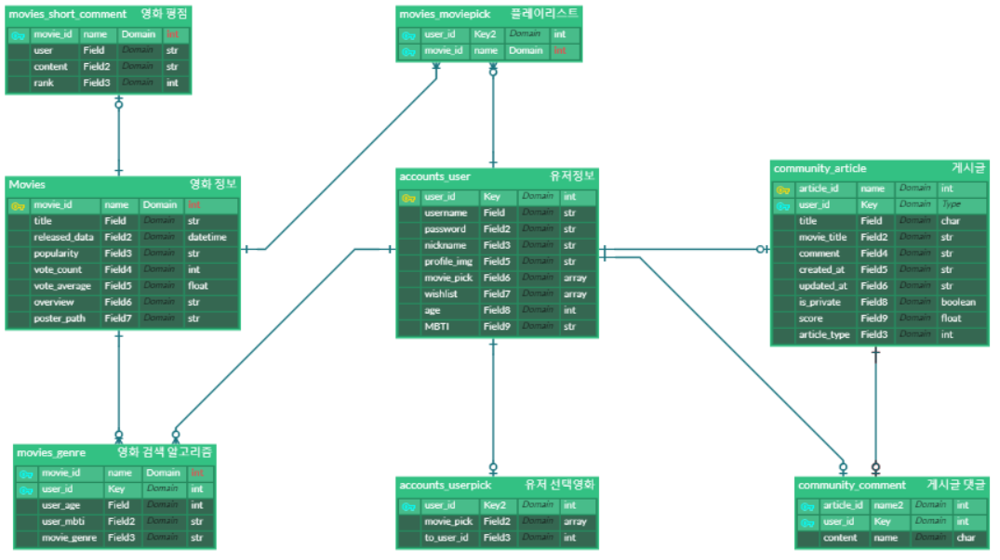
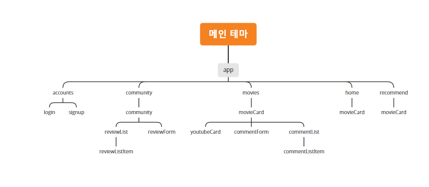
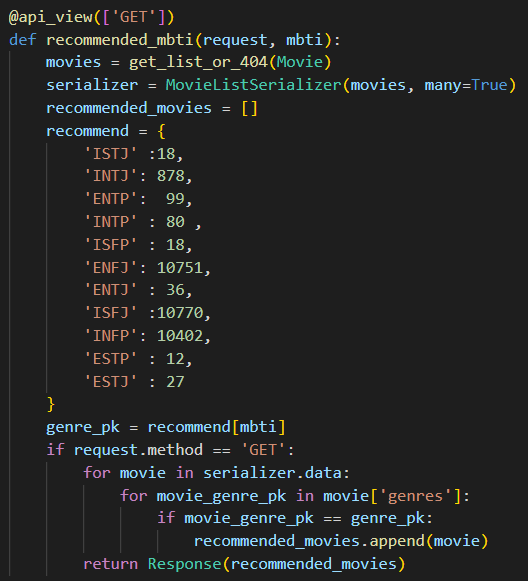
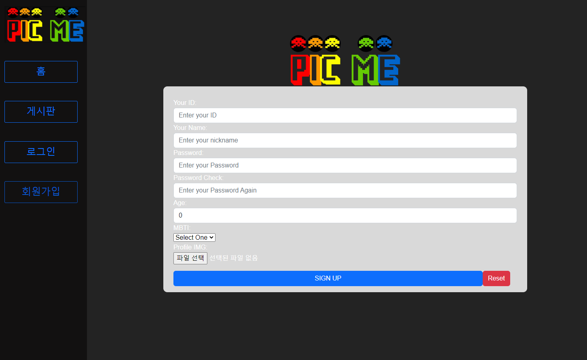
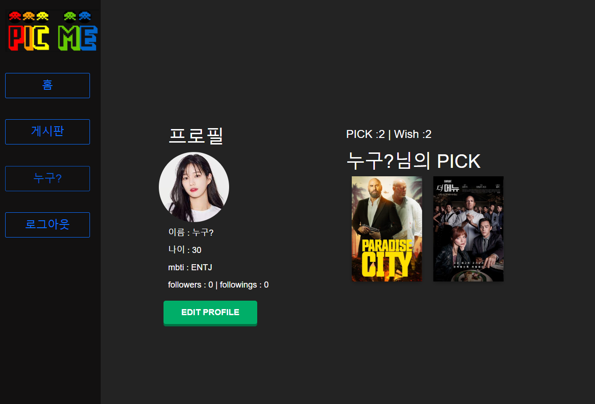
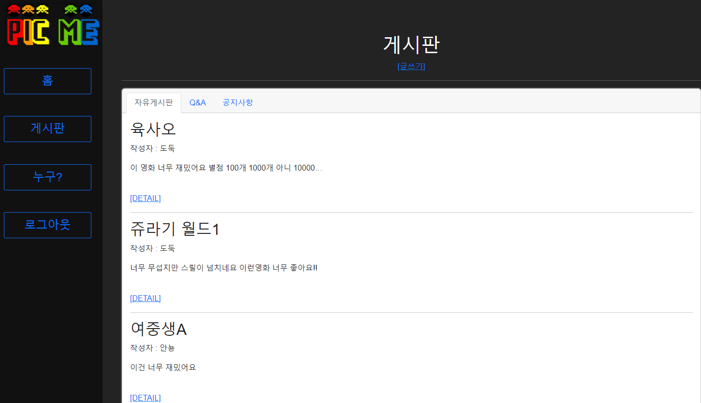
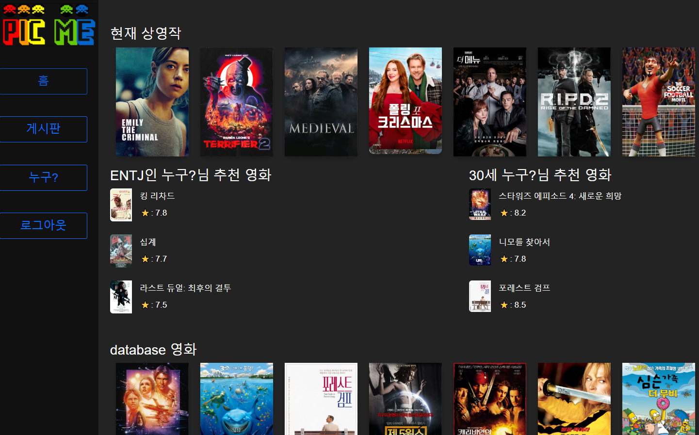

# README.md

팀명 :  AVG 27.5   팀원: 양은진, 엄형규

## 1. 팀원 정보 및 업무 분담 내역

#### 엄형규

- accounts
  - 계정 age, mbti, nickname, 프로필 이미지가 추가된 custom user사용
  - adapter를 통한 변환
  - 계정 로그인, 회원가입, 로그아웃, 계정 편집
- profile
  - pick list, wish list 보여주기
- css 전반
  - vue bootstrap
  - css

#### 양은진

- articles

  - 게시글 작성, 수정, 삭제
  - 댓글 작성, 삭제
  - 사용자 프로필 간 이동

- movies

  - movie data 받기 + 가공

  - 영화 상세정보 페이지 구현

  -  Youtube 예고편 띄우기

  - 리뷰 작성, 좋아요, 삭제 구현

    

## 2. 목표 서비스 구현 및 실제 구현 정도

### 목표 서비스

1. 영화 조회 서비스

   장르별 영화 조회

   영화 상세 조회 > 리뷰, 평점

   영화 검색 기능

   Youtube trailer 띄우기

2. 영화 추천 서비스

   → 장르에 따라 소개(최초 데이터)

   연령대에 따라 필터링

   MBTI에 따라 필터링

3. Community 기능

   랜덤으로 1~2명 것 보여주기

   (개인페이지) 영화 좋아요 눌러서 개인 리스트 생성

4. 유저 정보

   팔로우 기능 구현

   소셜 로그인 (카카오)

### 구현 정도

1. 영화 조회 서비스

   영화 상세 조회 > 리뷰, 평점

   Youtube trailer 띄우기

2. 영화 추천 서비스

   → 장르에 따라 소개(최초 데이터)

   연령대에 따라 필터링

   MBTI에 따라 필터링

3. Community 기능

   (개인페이지) 영화 좋아요 눌러서 개인 리스트 생성

4. 유저 정보

   팔로우 기능 구현

   

## 3. 데이터베이스 모델링(ERD)

## 4. 영화 추천 알고리즘에 대한 기술적 설명

### 1. 현재 상영작 추천

API를 사용하여 TMDB LATEST 정보를 불러와 랜덤으로 추천

### 2. 나이별 영화 추천

회원가입시 사용자의 나이를 받아 (현재년도 - (나이//2) )년도에 상영되었던 영화를 추천

영화를 보는 시간대를 나이//2를 통해 추천

### 3. MBTI별 영화 추천

### 

회원가입시 수집한 사용자의 MBTI를 활용하여, MBTI별 특성에 따라 장르를 정해 랜덤으로 영화를 추천

ISTJ : 한번 시작한 일은 끝내는 성격 : 오리지널 드라마 도전 드라마 장르 추천

INTJ : 논리적인 성격 : SF, 미스터리 →  SF, 미스터리 장르 추천

INFJ : 관찰력 좋고 감수성이 풍부함 : 다양한 장르의 오리지널 드라마 도전 -> 전체에서 랜덤 5개 

ENTP : 독창적이고 창의력이 풍부함 : 에피소드 형식 →  다큐멘터리 장르 추천

ISTP : 방대한 영화에서 자신에게 알맞는 영화 검색→   전체에서 랜덤 5개 추천

INTP : 비평적 사고로 다양한 영화 분석 →  (범죄) 장르 추천 

ENFP : 한줄 평을 보고 영화를 선택 →  LATEST영화

ESFJ : 핫한 영화 →  LATEST영화

ISFP : 마음이 착함 →  멜로,드라마 장르 추천 

ENFJ : 진실됨 : 따듯한 영화 →  가족 장르 추천 

ESFP : 변화에 잘 적응 최신 유행 드라마 → 최근 영화 추천 

ENTJ : 상대를 이끄는 장면이 나오는 드라마 →  역사 장르 추천

ISFJ : 단체 생활에 최적화 : 예능 → (TV영화) 장르 추천 

INFP : 감수성이 풍부함  (음악) 장르 추천 

ESTP : 활동적이지만 크로나 19로 여행 못가는 →  버라이어티 예능→  (모험) 장르 추천 

ESTJ : 체계적이고 논리적인 

ESTJ → 많이 본 장르 또는 (공포) 장르 추천

## 5. 서비스 대표 기능에 대한 설명

### 자신만의 PICK LIST

사용자의 정보를 수집하여 영화를 추천하기 위해서 회원가입시 사용자의 나이, MBTI를 수집합니다.

자신만의 PICK LIST를 만들어 ‘영화 플레이리스트’를 생성할 수 있으며 이를 게시판에서 다른 사용자들과 공유할 수 있습니다.

자신만 공유하고 싶은 영화는 WISH LIST를 만들어 관리할 수 있습니다.

자신과 유사한 영화 pick리스트를 가진 유저들을 통해 유저들이 추천하는 pick리스트로 자신에게 적합한 영화를 볼 수 있습니다.

### 게시판 기능

사용자들은 회원가입, 프로필 수정 시에 등록 가능한 프로필 이미지와, 닉네임을 사용하여 개인 PICK LIST를 어필할 수 있으며 다른 사용자들을 팔로우하여 영화 리스트를 공유할 수 있습니다.

게시글은 목적에 따라 다르게 관리합니다. 특히 공지사항의 경우는 관리자에 의해서 관리되며 작성 또한 관리자에게만 권한이 있습니다.

### 영화 정보 

PICK LIST와 나중에 볼 영화(WISH LIST)는 프로필에서 볼 수 있으며, 영화 포스터를 클릭하여 영화 detail페이지로 이동할 수 있습니다.

detail페이지에서는 PICK, WISH할 수 있는 버튼이 있으며, 영화 예고편이 자동재생 됩니다.

영화 상세 페이지에서 리뷰를 작성하고 좋아요 버튼을 클릭하며 사용자들 간 소통이 가능합니다.

## 6. 배포 서버 URL (배포했을 경우)

배포하지 않음

## 7. 기타 (느낀 점, 후기 등)

### 엄형규

기본 구조를 피그마를 통해 미리 짜두고 ERD를 통해 프론트, 백 양쪽의 기본 베이스를 지정해 두었습니다. 이로 인해 전반적인 데이터 작업을 하는데 혼동이 없었습니다. 데이터를 머리에서 이해한 것처럼 작성하는 것에는 어려움이 많았지만 배운 모든 것을 다시 복습하면서 풀어나갈 수 있었습니다. 이후에는 전반적인 이해도가 향상함에 따라 생각보다 빠른 속도로 만들어 나갈 수 있었습니다.

특히, dj-rest-auth의 강력한 로그인 기능과 customuser과의 충돌에서 유저를 custom하는 방법들에 대한 이해도가 크게 높아졌습니다.

또한 css와 처음 써보는 vue-bootstrap을 다양한 방법으로 쓰면서 처음에는 카드하나 만들던 시간에 한페이지를 만들수 있게 되었고 hove와 같은 역동성 있는 기능들도 공부하게 되었습니다.

새로운 것들을 배울 수 있었다는 점에서 유익했고 아쉬운 점도 많았던 것 같습니다.

### 양은진

사전 목표와 구조에 대한 논의가 충분히 이루어져야 함을 알고 있었으나, 중요도에 따라 시간분배를 하지 못해 아쉬웠습니다. 또한 역할 분담에 대한 이해가 높아져 함께 작업할 상황에서도 적절히 분담해서 진행할 수 있게 되었습니다. 프로젝트에 문제가 생겼을 때 함께 고민하며 페어에게 든든함을 느낄 수 있었고, 서로 적절한 도움을 주면서 진행할 수 있었습니다. 다음 프로젝트에서는 시간분배와 GIT 활용에 더욱 신경 써서 진행해보고 싶습니다.

이번 프로젝트를 통해 싸피 1학기 동안 배워왔던 과정을 전체적으로 복습하고, 이해할 수 있었습니다. 또, 필요한 데이터를 가져오고, 가공하여 사용할 수 있게 되었으며 백엔드, 프론트엔드 간의 데이터 연결과 이동과정을 완전히 이해할 수 있었습니다.